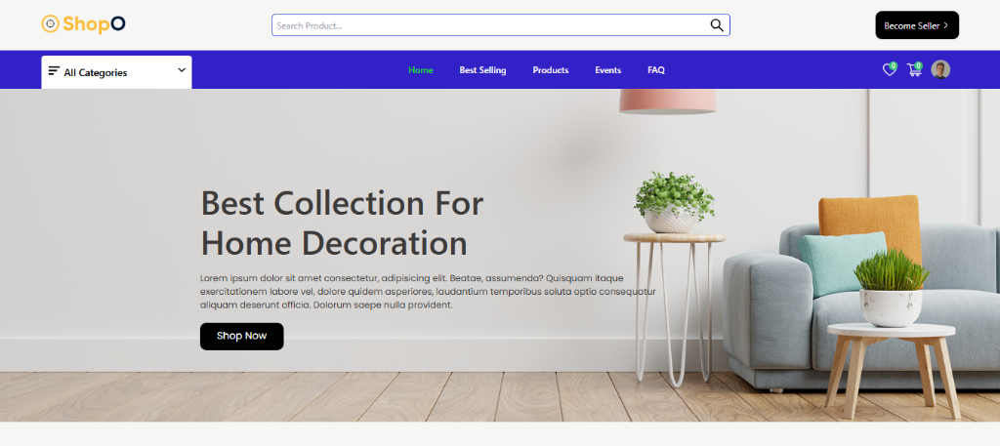

# Multi-Vendor E-Commerce Platform



A feature-rich, full-stack Multi-Vendor E-Commerce platform built with Node.js, Express, MongoDB, React, Tailwind CSS, Redux Toolkit, and Socket.IO.

**Author:** Hasham Tanveer  
**Repository:** Multi-Vendor E-Shop

---

## 🚀 Key Features

### 🛍️ Customer Experience
- **Product Catalog & Search**: Advanced product browsing, category filtering, search, and featured deals.
- **Product Details & Reviews**: Ratings, customer reviews, suggested related products, and image galleries.
- **Shopping Cart & Wishlist**: Persistent cart, real-time quantity updates, and wishlist management.
- **Checkout & Secure Payments**: Multi-step checkout with Stripe payment integration and address book management.
- **Order Tracking & History**: Real-time order progress tracking and detailed order summaries.
- **Real-Time Live Chat**: Direct messaging between customers and shop sellers powered by Socket.IO.

### 🏬 Seller / Multi-Vendor Hub
- **Shop Registration & Profile**: Dedicated seller onboarding, custom shop profiles, and branding.
- **Product & Event Management**: Create, edit, and manage products, event flash sales, and discount coupon codes.
- **Order Fulfillment & Refunds**: Process incoming orders, update shipping stages, and handle refund requests.
- **Earnings & Payouts**: Real-time revenue analytics, withdraw requests, and payout tracking.
- **Seller Inbox**: Instant messaging with buyers and customer support.

### 🛡️ Admin Dashboard
- **Platform Analytics**: Overview of total platform users, sellers, products, and global revenue.
- **Moderation & Management**: Manage users, approve sellers, view all platform orders, and process withdrawal requests.

---

## 🛠️ Technology Stack

| Layer | Technologies |
|---|---|
| **Frontend** | React 18, Tailwind CSS, Redux Toolkit, React Router v6, React Icons, Lottie Animations |
| **Backend API** | Node.js, Express.js, MongoDB (Mongoose ODM), JWT, Bcrypt, Multer |
| **Real-time Engine** | Socket.IO |
| **Payments & Media** | Stripe API, Cloudinary, Nodemailer |

---

## 📂 Project Architecture

```
Multi Vendor/
├── backend/                  # Express REST API Server
│   ├── config/               # Environment configuration (.env)
│   ├── controller/           # Route business logic (user, shop, product, order, payment)
│   ├── db/                   # MongoDB connection configuration
│   ├── middleware/           # Auth guards & error handlers
│   ├── model/                # Mongoose database schemas
│   ├── utils/                # Token generation, email sending, custom error handler
│   ├── app.js                # Express app middleware & route registration
│   └── server.js             # API server entrypoint (Port 8000)
├── frontend/                 # React Single Page Application
│   ├── public/               # Static assets & HTML index
│   └── src/
│       ├── components/       # Reusable UI components (Cart, Layout, Products, Admin, Shop)
│       ├── pages/            # Page components and views
│       ├── redux/            # Redux store, actions, and reducers
│       ├── routes/           # Protected routes & router configurations
│       └── server.js         # API endpoint base configuration (Port 3000)
└── socket/                   # Real-time WebSocket Service
    └── index.js              # Socket.IO event listeners & message handlers (Port 4000)
```

---

## ⚡ Quick Start Guide

### 1. Prerequisites
- **Node.js**: v18+ (tested up to v24)
- **MongoDB**: Local MongoDB instance (`127.0.0.1:27017`) or MongoDB Atlas URI

### 2. Environment Variables Configuration

In `backend/config/.env`:
```env
PORT = 8000
DB_URL = mongodb://127.0.0.1:27017/eshop
JWT_SECRET_KEY = "<your_jwt_secret>"
JWT_EXPIRES = 7d
ACTIVATION_SECRET = "<your_activation_secret>"
STRIPE_API_KEY = "<your_stripe_public_key>"
STRIPE_SECRET_KEY = "<your_stripe_secret_key>"
CLOUDINARY_NAME = "<your_cloudinary_name>"
CLOUDINARY_API_KEY = "<your_cloudinary_api_key>"
CLOUDINARY_API_SECRET = "<your_cloudinary_api_secret>"
```

In `socket/.env`:
```env
PORT = 4000
```

### 3. Installation & Running

#### Step A: Backend API
```bash
cd backend
npm install
npm start
# Runs on http://localhost:8000
```

#### Step B: Socket Server
```bash
cd socket
npm install
npm start
# Runs on http://localhost:4000
```

#### Step C: Frontend App
```bash
cd frontend
npm install --legacy-peer-deps
npm start
# Runs on http://localhost:3000
```

---

## 📜 License
This project is open-source and available under the ISC License.  
Developed & Maintained by **Hasham Tanveer**.
